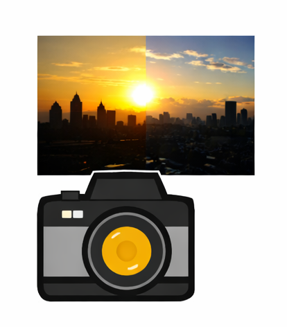
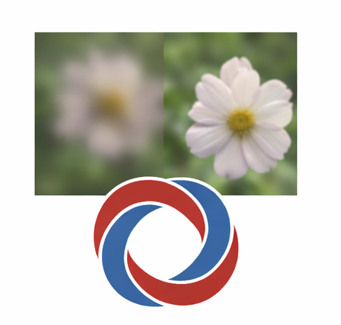
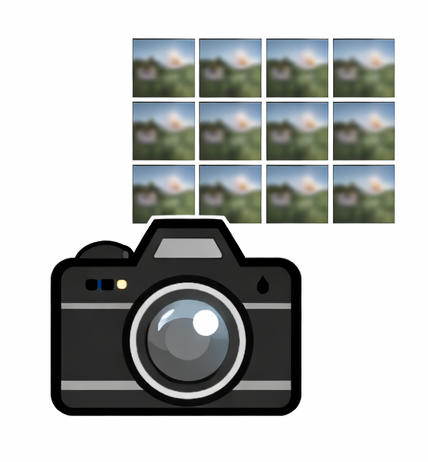
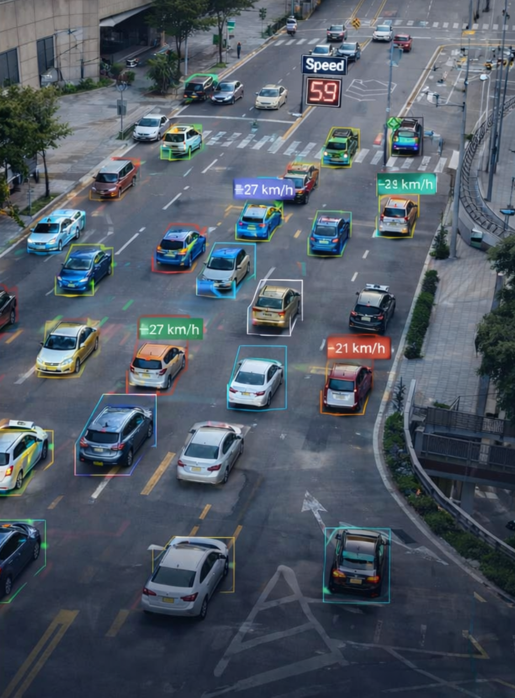
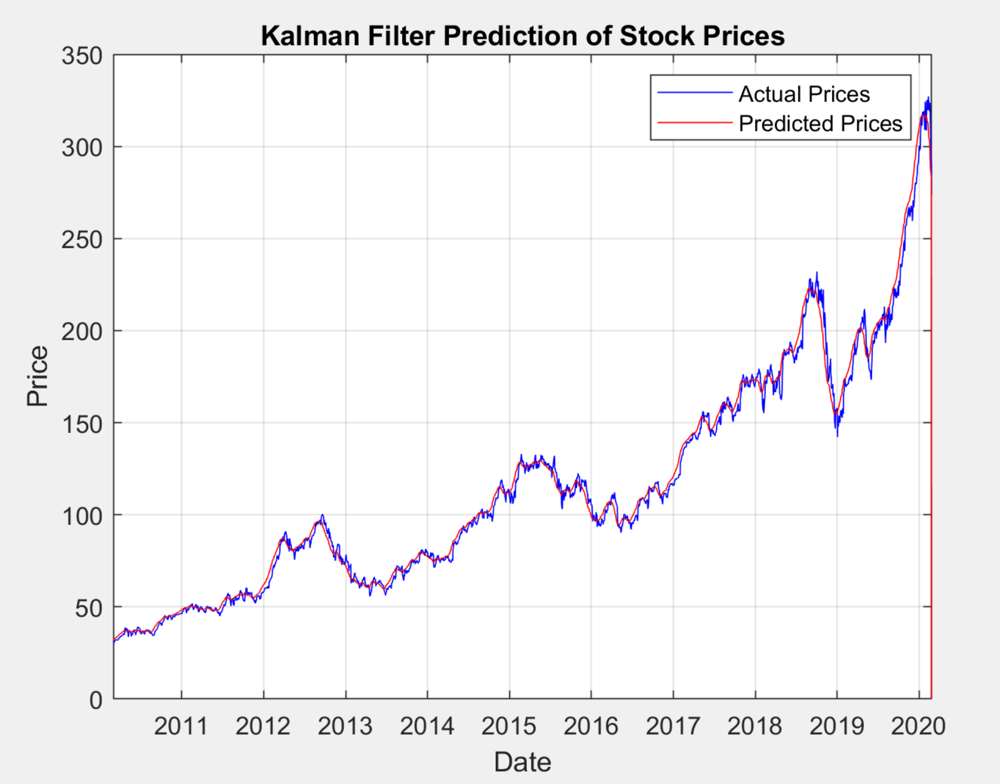

#### Ph.D. Student | Electrical Engineering | University of Maryland, College Park  
**Research Areas:** Computational Imaging, Machine Learning, AI Agents   
**Technical Skills:** Python, C/C++, MATLAB, Assembly, PyTorch, TensorFlow, OpenCV, Ghidra, FAISS, Milvus, Git, Linux

---

## Education
- **Ph.D. in Electrical Engineering** | University of Maryland, College Park (_Expected May 2028_)
- **M.Sc. in EEE**  | IUT, Bangladesh (_March 2019_)
- **B.Sc. in EEE**  | IUT, Bangladesh (_December 2015_)  
  -*Rank 1 / 87 — OIC Gold Medalist*

---

## Work Experience

**Graduate Teaching Assistant — University of Maryland, College Park (_Fall 2024 – Present_)**  
Conduct laboratory sessions, grade assignments, and assist with instruction for core ECE courses, while mentoring students on signal processing, systems, and programming fundamentals.

**Assistant Professor — IUT, Bangladesh (_Oct 2019 – Aug 2024_)**  
Led undergraduate courses and laboratory sessions in EEE, supervised student projects, conducted research, and published in peer-reviewed venues.

**Research Assistant — Institute of Energy and Environment, IUT (_Aug 2019 – Nov 2020_)**  
Performed solar panel flash testing, experimental evaluation, and technical report writing, contributing to applied renewable energy research.

**Lecturer — IUT, Bangladesh (_Oct 2019 – Aug 2024_)**  
Led undergraduate courses and laboratory sessions in EEE, supervised student projects.

---

## Projects

### High Dynamic Range (HDR) Imaging Pipeline  
[GitHub Repository](https://github.com/fuadadnan16/HDR-High-Dynamic-Range-_imaging)

  

This project focuses on building an end-to-end HDR imaging pipeline starting from RAW sensor data and producing perceptually optimized display-ready images. The pipeline includes demosaicing, white balance, exposure normalization, multi-exposure fusion using multiple weighting strategies, Reinhard tone mapping, and sRGB gamma correction. The system was implemented in **Python** using **dcraw**, **ExifRead**, **NumPy**, **OpenCV**, and **Matplotlib**, with extensive parameter sweeps to study the trade-off between visual quality and file size.

---

### Plug-and-Play ADMM for Image Deblurring and Denoising  
[GitHub Repository](https://github.com/fuadadnan16/Plug-and-Play-ADMM)

  

The goal of this project is to explore optimization-based image restoration using a Plug-and-Play ADMM framework that integrates powerful denoisers as implicit priors. A complete ADMM solver was implemented from first principles, incorporating **BM3D** within the iterative optimization loop. The implementation uses **Python**, **FFT-based solvers**, and **conjugate gradient methods**, and was evaluated across multiple blur kernels and noise settings, achieving up to **35–36 dB PSNR** with systematic parameter tuning.

---

### Light Field Imaging and Depth-from-Refocus  
[GitHub Repository](https://github.com/fuadadnan16/Light_Field_imaging)

  

This project investigates depth estimation and synthetic refocusing using plenoptic images without explicit 3D reconstruction. A complete light field pipeline was developed to extract sub-aperture views, generate focal stacks through synthetic refocusing, and estimate depth using sharpness-weighted fusion and depth-from-refocus techniques. The system was implemented in **Python** using **NumPy**, **OpenCV**, and scientific computing tools, producing accurate depth maps and all-in-focus images.

---

### Drone-Based Traffic Congestion Analysis Using Real-Time Detection and Tracking 

  

Dynamic Traffic Analysis and Congestion Management: Leveraging ’N-Curves’ and Real-Time Velocity Insights. The project involves key insights on road traffic detection from drone-captured videos, where computer
vision and deep learning have been utilized to analyze vehicle speed, congestion, and traffic rule violations. Here, for vehicle detection YOLO has been used , for vehicle tracking Deep-SORT has been implemented.

---

### Kalman Filter–Based Volatility Estimation and Stock Price Forecasting

[GitHub Repository](https://github.com/fuadadnan16/KALMAN-Filter-for-Stock-Price-Prediction)

  

Calculation of the stock’s volatility, and prediction of future prices based on both the current price and volatility using a Kalman filter. This model offers a practical introduction to financial forecasting with Kalman filters.
 
## Publications

1. **M. Fuad Adnan et al.**, *M.Digitize-HCD: A Dataset for Digitization of Handwritten Circuit Diagrams*,  
   **Data in Brief**, 2025.  
   [https://doi.org/10.1016/j.dib.2025.111315](https://doi.org/10.1016/j.dib.2025.111315)

2. **M. Fuad Adnan et al.**, *Traffic Congestion Prediction using Deep Convolutional Neural Networks: A Color-Coding Approach*,  
   **ICEET 2022**.  
   [https://doi.org/10.1109/ICEET56468.2022.10007425](https://doi.org/10.1109/ICEET56468.2022.10007425)

3. **M. Arafat, M. Adnan, M. Islam**, *AI-based Affordable High-Density Traffic Monitoring System*,  
   **NCIM 2023**.  
   [https://doi.org/10.1109/NCIM59001.2023.10212910](https://doi.org/10.1109/NCIM59001.2023.10212910)

---

## Links
- [LinkedIn](https://www.linkedin.com/in/mirza-fuad-adnan-951947143)
- [Google Scholar](https://scholar.google.com/citations?user=9Xr64mMAAAAJ&hl=en)
- **Email:** adnan16@umd.edu
